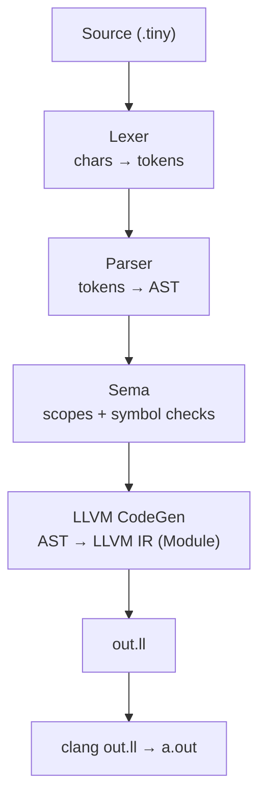

#A Small LLVM-Based Frontend Compiler (C++20 / LLVM)

A small educational **compiler frontend** written in **modern C++ (C++20)** that targets **LLVM IR**.
It implements the classic compiler pipeline:

- **Lexical analysis** (Lexer) → tokens  
- **Syntactic analysis** (Recursive-descent Parser) → AST  
- **Semantic analysis** (Sema) → scoped symbol table checks  
- **Code generation** (LLVM IRBuilder) → `out.ll`  
- (Optional) Native executable via `clang out.ll -o a.out`

This project is intentionally scoped to keep it approachable while still “real”:
no preprocessor, no pointers, no structs, no floats — **integers only**.

---

## Features

### Language subset
- `int` variables and integer literals
- Variable declarations: `int x = 10;` *(init required by default)*
- Assignments: `x = x + 1;`
- Arithmetic: `+  -  *  /` with correct precedence and parentheses
- Control flow:
  - `if (...) stmt else stmt`
  - `while (...) stmt`
- Blocks: `{ stmt* }` (nested scopes)
- Functions:
  - definitions: `int add(int a, int b) { ... }`
  - calls: `add(2, 3)`
- `return expr;`

### Output
- Emits valid **LLVM IR** (`out.ll`)
- You can link to a native binary using **clang**

---

## Architecture



### Component responsibilities
- **lexer/**: reads characters, produces tokens (keywords, identifiers, numbers, punctuation)
- **parser/**: recursive-descent parser; enforces grammar + precedence; builds AST
- **ast/**: AST node types + visitor interface + (optional) printer
- **sema/**: semantic checks (declared-before-use, duplicate declarations, function arity, scoping)
- **llvm/**: minimal code generator that maps the AST to LLVM IR using `llvm::IRBuilder`
- **main.cpp**: driver that runs the full pipeline and writes `out.ll`

---


## Build & Run

### Prerequisites
- Linux (or any Unix-like environment)
- **clang++** and **clang**
- **LLVM 17+** with `llvm-config` available in PATH

Verify:
```bash
clang++ --version
clang --version
llvm-config --version
```

### Build
From the project root:
```bash
make
```

This produces:
- `./mycompiler`

### Compile a program to LLVM IR
```bash
./mycompiler examples/01_hello.tiny
# writes: out.ll
```

You can also specify an output path:
```bash
./mycompiler examples/01_hello.tiny my_output.ll
```

### Link LLVM IR to a native executable
```bash
clang out.ll -o a.out
./a.out
echo $?
```

For these examples, the process exit code is the value returned by `main()`.

### Clean
```bash
make clean
```

---

## Examples

The `examples/` folder includes small programs that demonstrate each feature:

- `01_hello.tiny` — minimal return
- `02_expr_precedence.tiny` — precedence `2 + 3 * 4`
- `03_variables.tiny` — decl + assignment
- `04_if_else.tiny` — branching
- `05_while.tiny` — loops
- `06_functions.tiny` — function defs + calls
- `07_nested_scopes.tiny` — scope rules
- `08_forward_call.tiny` — calling a function defined later
- `09_error_cases/` — semantic failures (undefined vars, duplicate decl, wrong arity)

---

## Unit Tests

The `unit_tests/` folder is structured to test each stage independently:
- lexer tests
- AST construction / visitor tests
- parser shape tests
- semantic error tests

Typical run:
```bash
bash unit_tests/run_all.sh
```

(Adjust the script paths if your folder naming differs.)

---

## Notes on Design

- **Variables are lowered to stack slots** using `alloca` + `load/store`.
- This keeps codegen simple and beginner-friendly.
- LLVM can optimize these later (e.g., promote to registers), but optimization is intentionally minimal in this project.

---

## Roadmap (optional ideas)
- `break` / `continue`
- better diagnostics with line/column spans
- basic optimization flags (`-O0/-O1`) via LLVM passes

---

## License
Educational / personal project — add a license if you plan to share it publicly.
